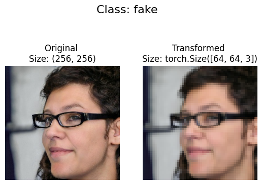
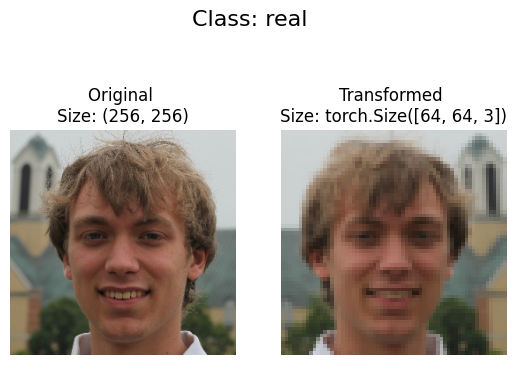
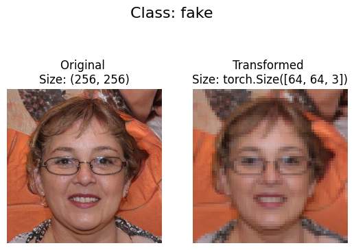

# Image Classification for Dataset of 10k Real vs. Fake Faces

This dataset was found on Kaggle([Link](https://www.kaggle.com/datasets/sachchitkunichetty/rvf10k)) and is a dataset containing 
10000 256x256 colour images of real and fake faces. There are 7000
images for training and 3000 images for validation.

## Objective

Our objective is to implement different popular Convolutional Neural
Network classifiers and show how much accuracy the classifiers can 
achieve using GPU-enabled Pytorch.


## Preprocessing

We load up our images from our data directory and load it into 
train and test dataloaders while transforming our images from 
256x256 to 64x64 , with a training batch size of 64. We downsample
our images to reduce training time.






## Training 

We train our models with the following loss function and optimization
function:-

```python
criterion = nn.CrossEntropyLoss()
optimizer = optim.Adam(model1.parameters(), lr=0.0001)
```

O stands for Fake and 1 for Real.
### LeNet

<pre>
Accuracy on the test set: 76 %
Classification Report:
              precision    recall  f1-score   support

           0     0.7757    0.7353    0.7550      1500
           1     0.7484    0.7873    0.7674      1500

    accuracy                         0.7613      3000
   macro avg     0.7620    0.7613    0.7612      3000
weighted avg     0.7620    0.7613    0.7612      3000
</pre>
### AlexNet
<pre>
Accuracy on the test set: 78 %
Classification Report:
              precision    recall  f1-score   support

           0     0.7871    0.7840    0.7856      1500
           1     0.7849    0.7880    0.7864      1500

    accuracy                         0.7860      3000
   macro avg     0.7860    0.7860    0.7860      3000
weighted avg     0.7860    0.7860    0.7860      3000
</pre>
### Inception V1
<pre>
Accuracy on the test set: 77 %
Classification Report:
              precision    recall  f1-score   support

           0     0.8202    0.6933    0.7514      1500
           1     0.7344    0.8480    0.7871      1500

    accuracy                         0.7707      3000
   macro avg     0.7773    0.7707    0.7693      3000
weighted avg     0.7773    0.7707    0.7693      3000
</pre>

### VGG16
<pre>
Accuracy on the test set: 50 %
Classification Report:
              precision    recall  f1-score   support

           0     0.5000    1.0000    0.6667      1500
           1     0.0000    0.0000    0.0000      1500

    accuracy                         0.5000      3000
   macro avg     0.2500    0.5000    0.3333      3000
weighted avg     0.2500    0.5000    0.3333      3000
</pre>

### ResNet50
<pre>
Accuracy on the test set: 75 %
Classification Report:
              precision    recall  f1-score   support

           0     0.7393    0.7960    0.7666      1500
           1     0.7791    0.7193    0.7480      1500

    accuracy                         0.7577      3000
   macro avg     0.7592    0.7577    0.7573      3000
weighted avg     0.7592    0.7577    0.7573      3000
</pre>

### AlexNet (with Normalization every Convolution Layer)
<pre>
Accuracy on the test set: 72 %
Classification Report:
              precision    recall  f1-score   support

           0     0.6569    0.9447    0.7750      1500
           1     0.9015    0.5067    0.6487      1500

    accuracy                         0.7257      3000
   macro avg     0.7792    0.7257    0.7118      3000
weighted avg     0.7792    0.7257    0.7118      3000
</pre>

### VGG16 (with Normalization every Convolution Layer)
<pre>
Accuracy on the test set: 85 %
Classification Report:
              precision    recall  f1-score   support

           0     0.8620    0.8493    0.8556      1500
           1     0.8515    0.8640    0.8577      1500

    accuracy                         0.8567      3000
   macro avg     0.8567    0.8567    0.8567      3000
weighted avg     0.8567    0.8567    0.8567      3000
</pre>

## Conclusion

We can see that our altered VGG16 provides us the best result 
among all the models we used for training. Further improvement can
be done by altering the structure of the best performing CNNs. We can also increase our training and validation images to get even better result.

Identifying Real and Fake faces have become quite challenging due the 
massive improvement in generating photorealistic images by AI. This project shows us how we can leverage different deep learning models to
differentiate between Real and Fake.


