# Image Classification for Dataset of 10k Real vs. Fake Faces

This dataset was found on Kaggle([Link](https://www.kaggle.com/datasets/sachchitkunichetty/rvf10k)) and is a dataset containing 
10000 256x256 colour images of real and fake faces. There are 7000
images for training and 3000 images for validation.

## Objective

Our objective is to implement different popular Convolutional Neural
Network classifiers and show how much accuracy the classifiers can 
achieve using GPU-enabled Pytorch.


## Preprocessing

We load up our images from our data directory and load it into 
train and test dataloaders while transforming our images from 
256x256 to 64x64 , with a training batch size of 64. We downsample
our images to reduce training time.

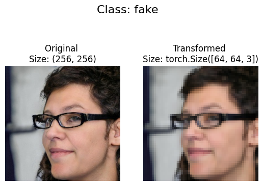
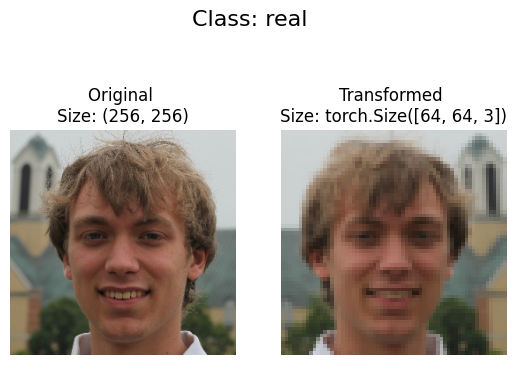
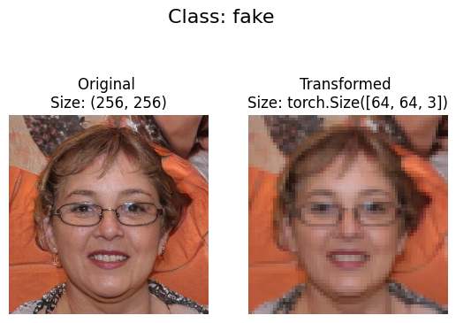


## Training 

We train our models with the following loss function and optimization
function:-

```python
criterion = nn.CrossEntropyLoss()
optimizer = optim.Adam(model1.parameters(), lr=0.0001)
```

O stands for Fake and 1 for Real.
### LeNet
<pre>
Accuracy on the test set: 72 %
Classification Report:
              precision    recall  f1-score   support

           0     0.6951    0.7887    0.7389      1500
           1     0.7558    0.6540    0.7012      1500

    accuracy                         0.7213      3000
   macro avg     0.7254    0.7213    0.7201      3000
weighted avg     0.7254    0.7213    0.7201      3000
</pre>
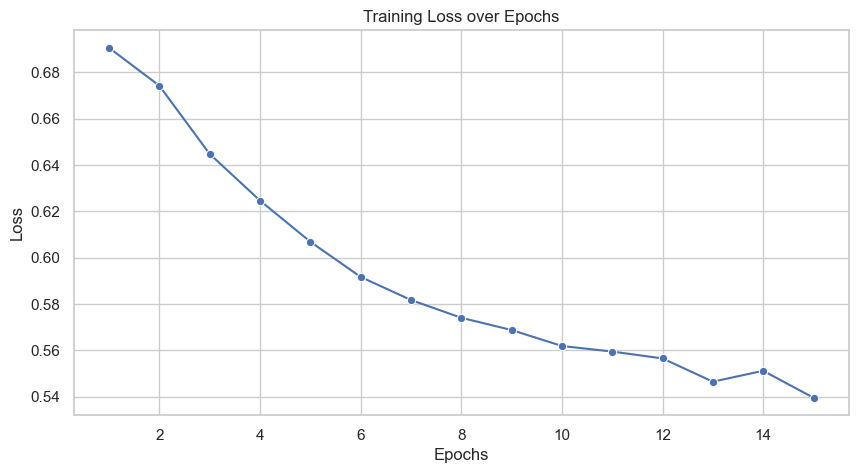 
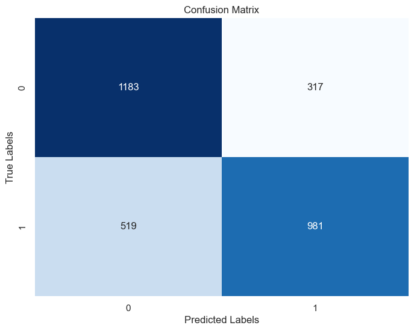
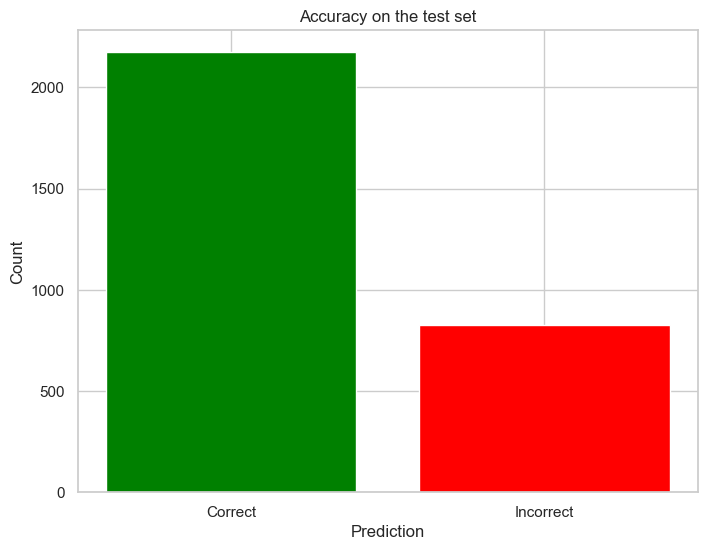
### AlexNet
<pre>
Accuracy on the test set: 76 %
Classification Report:
              precision    recall  f1-score   support

           0     0.8029    0.7007    0.7483      1500
           1     0.7345    0.8280    0.7784      1500

    accuracy                         0.7643      3000
   macro avg     0.7687    0.7643    0.7634      3000
weighted avg     0.7687    0.7643    0.7634      3000
</pre>
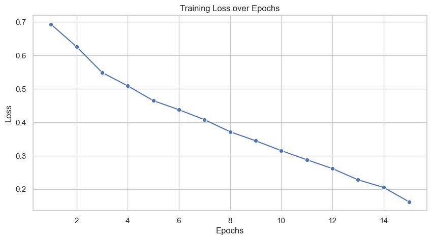 
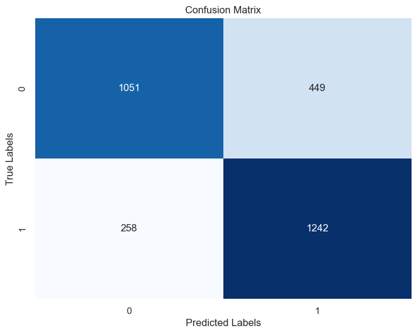
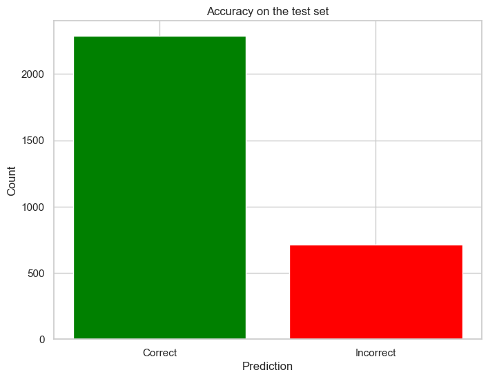
### Inception V1
<pre>
Accuracy on the test set: 75 %
Classification Report:
              precision    recall  f1-score   support

           0     0.7694    0.7140    0.7407      1500
           1     0.7332    0.7860    0.7587      1500

    accuracy                         0.7500      3000
   macro avg     0.7513    0.7500    0.7497      3000
weighted avg     0.7513    0.7500    0.7497      3000
</pre>
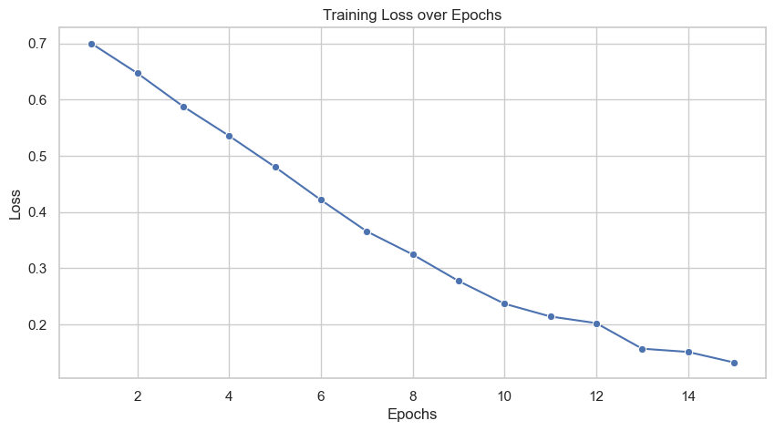 
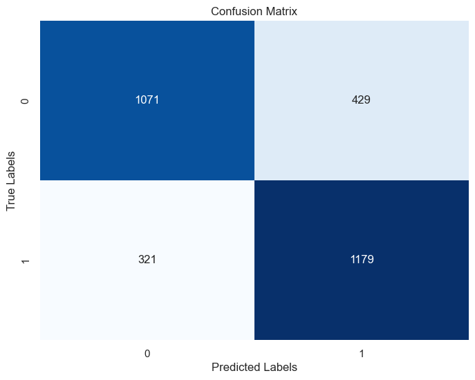
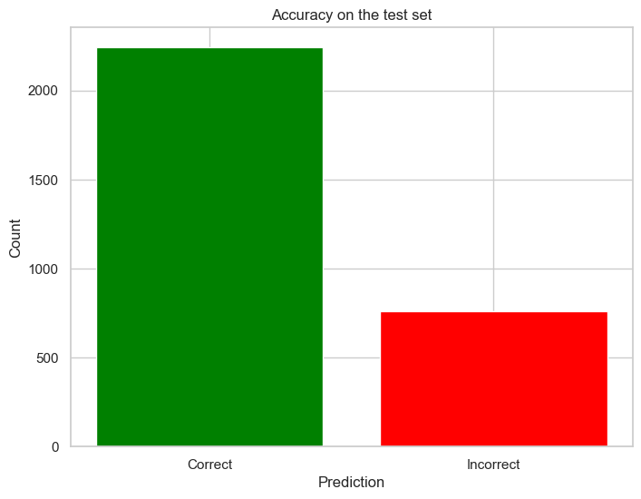
### VGG16
<pre>
Accuracy on the test set: 50 %
Classification Report:
              precision    recall  f1-score   support

           0     0.5000    1.0000    0.6667      1500
           1     0.0000    0.0000    0.0000      1500

    accuracy                         0.5000      3000
   macro avg     0.2500    0.5000    0.3333      3000
weighted avg     0.2500    0.5000    0.3333      3000
</pre>
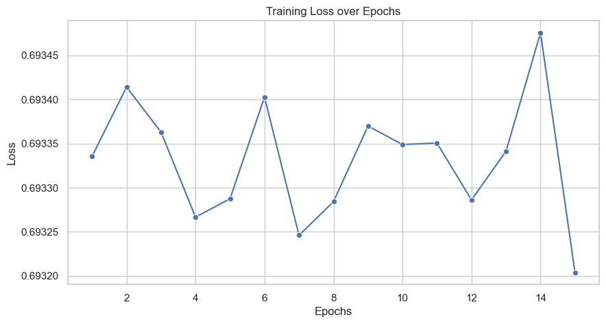 
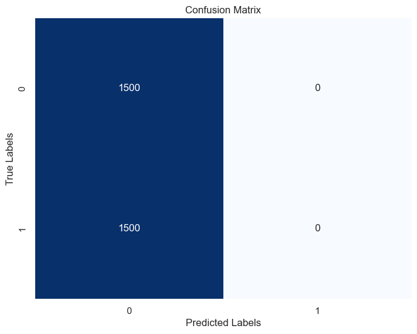
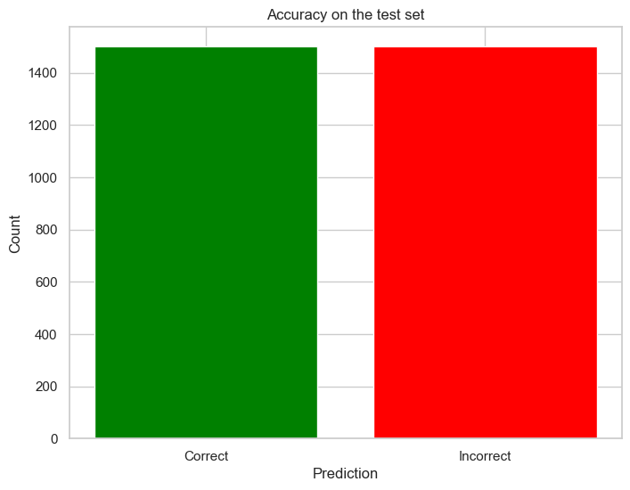
### ResNet50
<pre>
Accuracy on the test set: 74 %
Classification Report:
              precision    recall  f1-score   support

           0     0.7031    0.8367    0.7641      1500
           1     0.7984    0.6467    0.7145      1500

    accuracy                         0.7417      3000
   macro avg     0.7507    0.7417    0.7393      3000
weighted avg     0.7507    0.7417    0.7393      3000
</pre>
 
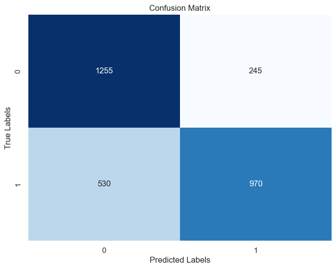
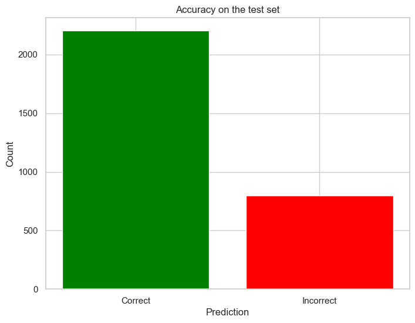
### AlexNet (with Normalization every Convolution Layer)
<pre>
Accuracy on the test set: 64 %
Classification Report:
              precision    recall  f1-score   support

           0     0.5839    0.9787    0.7314      1500
           1     0.9342    0.3027    0.4572      1500

    accuracy                         0.6407      3000
   macro avg     0.7590    0.6407    0.5943      3000
weighted avg     0.7590    0.6407    0.5943      3000
</pre>
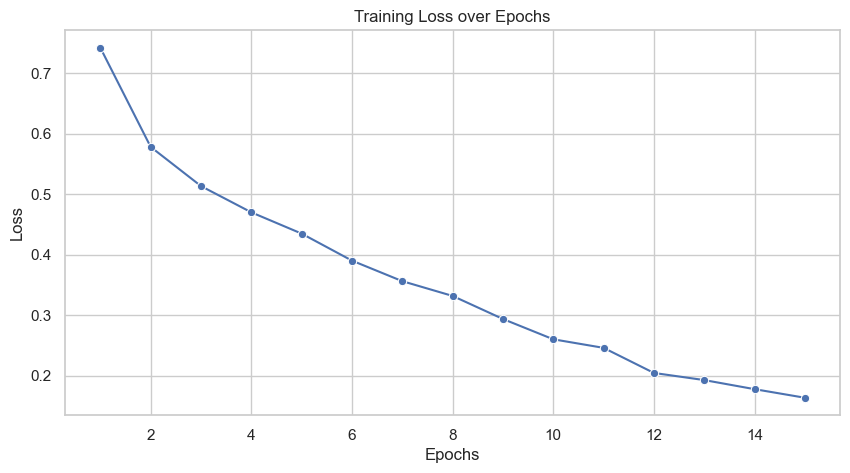 
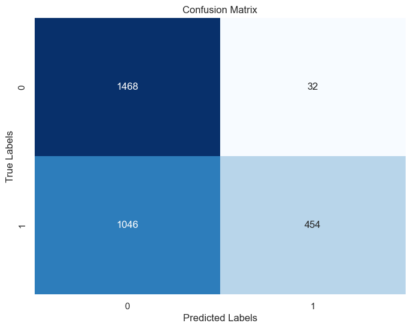
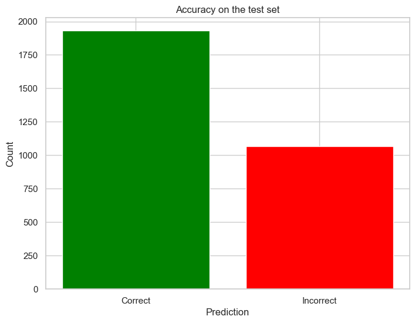
### VGG16 (with Normalization every Convolution Layer)
<pre>
Accuracy on the test set: 84 %
Classification Report:
              precision    recall  f1-score   support

           0     0.8455    0.8320    0.8387      1500
           1     0.8346    0.8480    0.8413      1500

    accuracy                         0.8400      3000
   macro avg     0.8401    0.8400    0.8400      3000
weighted avg     0.8401    0.8400    0.8400      3000
</pre>
 
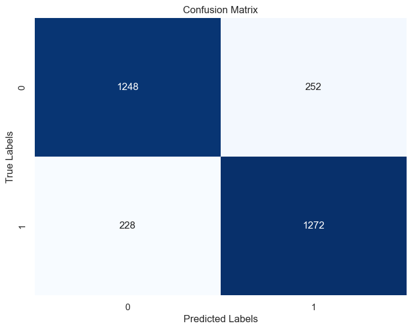
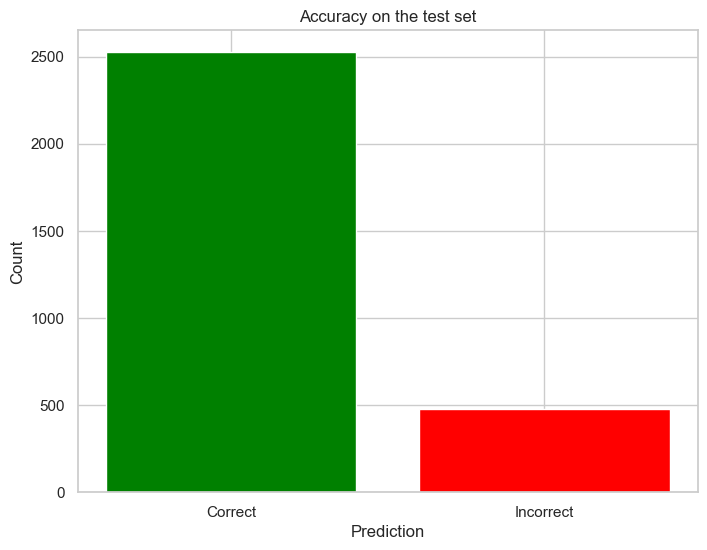
## Conclusion

We can see that our altered VGG16 provides us the best result 
among all the models we used for training. Further improvement can
be done by altering the structure of the best performing CNNs. We can also increase our training and validation images to get even better result.

Identifying Real and Fake faces have become quite challenging due the 
massive improvement in generating photorealistic images by AI. This project shows us how we can leverage different deep learning models to
differentiate between Real and Fake.


## Using Flask App
```console
$ pip install -r requirements.txt
$ python app.py
```

## Using Flask
<iframe width="560" height="315" src="static/Demo.mp4" frameborder="0" allowfullscreen></iframe>
